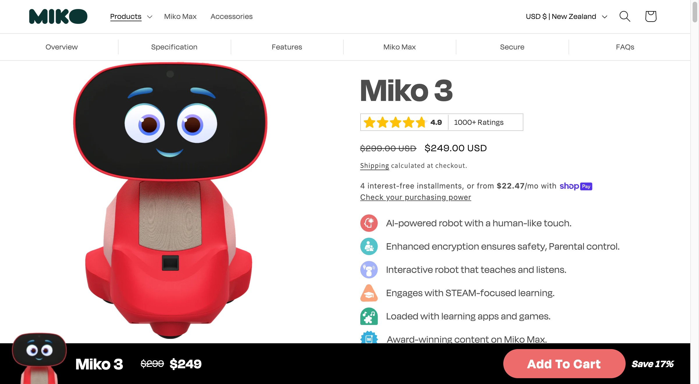

# 图片资源说明

## 目录结构

### `/products/` - 产品实物图
存放各AI硬件产品的官方图片,命名规范:
- `miko-3.jpg` - Miko 3教育机器人
- `elliq-3.jpg` - ElliQ陪伴机器人
- `oura-ring-gen3.jpg` - Oura Ring Gen 3
- `meta-rayban-gen2.jpg` - Meta Ray-Ban智能眼镜
- `humane-ai-pin.jpg` - Humane AI Pin
- `rabbit-r1.jpg` - Rabbit R1
- `sony-aibo.jpg` - Sony Aibo宠物机器人
- `senserobot-chess.jpg` - SenseRobot Chess下棋机器人
- `samsung-galaxy-ring.jpg` - Samsung Galaxy Ring

### `/logos/` - 公司/品牌Logo
- `miko-logo.png`
- `elliq-logo.png`
- `oura-logo.png`
- 等

### `/demos/` - 演示截图/GIF
- `humane-ai-pin-projection.gif` - AI Pin投影演示
- `elliq-interaction.jpg` - ElliQ互动场景
- `meta-rayban-ar.jpg` - Meta眼镜AR功能

### `/infographics/` - 信息图表
- `success-vs-failure.png` - 成功vs失败对比图
- `subscription-pricing.png` - 订阅定价策略
- `hardware-margin.png` - 硬件毛利底线

## 图片来源原则

1. **优先使用官方素材**
   - 产品官网press kit
   - 官方新闻稿图片
   - 官方社交媒体发布

2. **版权合规**
   - CC授权图片(标注来源)
   - 公开新闻图片(fair use)
   - 避免侵权

3. **图片引用格式**
```markdown

*图片来源: [Miko官网](https://miko.ai/)*
```

## YouTube视频链接规范

### 视频类型分类
1. **官方产品介绍** - 公司官方发布的产品介绍视频
2. **功能演示** - 具体功能展示和使用场景
3. **展会展示** - CES、IFA等展会现场演示
4. **媒体评测** - 权威科技媒体的深度评测
5. **用户开箱** - 真实用户的开箱体验

### 视频链接格式
```markdown
**官方演示视频**: [产品介绍](https://www.youtube.com/watch?v=example) | [功能演示](https://www.youtube.com/watch?v=example) | [展会展示](https://www.youtube.com/watch?v=example)
```

### 推荐频道
- **官方频道**: 各公司官方YouTube频道
- **科技媒体**: The Verge, Engadget, CNET, MKBHD
- **展会官方**: CES, IFA官方频道

## 图片规格建议

- **产品图**: 1200x800px, JPG/PNG, <500KB
- **Logo**: 透明背景PNG, 500x500px
- **信息图**: 1920x1080px, PNG, <1MB
- **GIF演示**: 800x600px, <2MB
